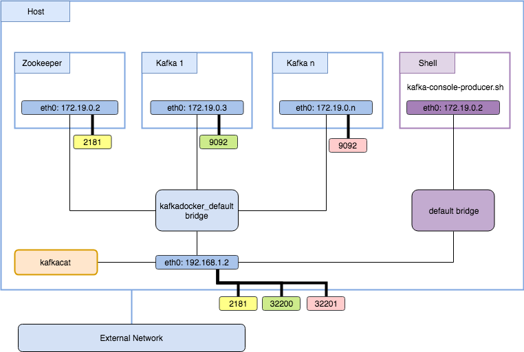

Kafka connectivity
==================

### TODO

-	Tidy up / Review
-	Add further examples?

A large amount of questions / issues opened against this project fall under the category of 'not understanding docker' or 'not understanding kafka'. This document aims to talk though the common connectivity issues and hopefully provide enough information to reduce these type of questions.

Communication paths
-------------------

To understand configuration a little better, we need to understand the main communication paths in kafka.

1.	Consumer -> Broker (for reading data)
2.	Broker -> Producer (for writing data)
3.	Broker -> Broker (replication etc)

This means for a complete working Kafka setup, each one of the components must be able to route to the other and have accessible ports.

How does each component know where the other component is on the network? Simple, zookeeper. Brokers read information directly from zookeeper, clients (producers/consumers) get this from the broker.

A Broker is configured with a `zookeeper.connect` string. When it starts up, it registers itself in the `/brokers/ids/<n>` zNode (where `<n>` is the broker.id config). As all brokers can talk to the same zookeeper, all the brokers (ergo all clients) can get the address of each broker.

Depending on your configuration, this will look something like:

```
{
  "listener_security_protocol_map": {
    "PLAINTEXT": "PLAINTEXT"
  },
  "endpoints": [
    "PLAINTEXT://one.prod.com:9092"
  ],
  "jmx_port": -1,
  "host": "one.prod.com",
  "timestamp": "1520972878198",
  "port": 9092,
  "version": 4
}
```

Look at the following diagram


It shows the basic Kafka communication paths (ignoring docker for now). Here you can see that Kafka brokers not only respond to external requests (from consumers/producers) but they also talk to each other (for replication amongst other things).

This helps us understand the answer to one of the common questions, "What should the hostname/IP be for KAFKA_ADVERTISED_HOSTNAME?"

Well, we know it has to meet at least the following two criteria:

1.	Routable from external clients
2.	Routable from other brokers

So for a multi-node cluster, this cannot be 'localhost' as node1 would not be able to route to node2 via 'localhost'. It would need it's IP or FQDN.

Now look at how docker networking works (at a high-level)


Here you can see that each container (Zookeeper, Kafka 1, Kafka 2) are in their own isolated namespaces, which includes an IP that is only routable via the `kafkadocker_default` bridge network. Internal to the network these containers expose the underlying service through the standard ports (2181/9092). However external to this bridge network they are mapped to available ports on the hosts network (192.168.1.2).

How do we connect to the containers from external components (other containers/standalone processes etc) ?



As you can see in the case of the standalone process `kafkacat`, this only has access to the hosts network. So to access zookeeper or kafka, it has to use the mapped port on the host network (i.e. Kafka 1 would be routable on `192.168.1.2:32200` )

In the case of the `Shell` container, when it is started it is bound to a different bridge network. This again, only has access to other containers in the default bridge network, or on the host network. So just like the standalone process, Kafka 1 could be reached on `192.168.1.2:32200`.

This also tells us that our `KAFKA_ADVERTISED_HOST_NAME` would need to be `192.168.1.2` so it is routable from both inside the containers and external clients.

This helps answer another common question that arises from following the tutorials, "What should I use for zookeeper host?"

In the case of the `kafka-topics.sh` command, the tutorial has

```
$ start-kafka-shell.sh <DOCKER_HOST_IP> <ZK_HOST:ZK_PORT>
$ $KAFKA_HOME/bin/kafka-topics.sh --create --topic topic --partitions 4 --zookeeper $ZK --replication-factor 2
```

Looking at the above diagram, it should be clear that both the `DOCKER_HOST_IP` and `ZK_HOST` need to be the host machines IP of `192.168.1.2` so it is routable.

References
----------

-	[Understanding docker networking drivers](https://blog.docker.com/2016/12/understanding-docker-networking-drivers-use-cases/)
-	[Read internal offset](http://dayooliyide.com/post/kafka-consumer-offsets-topic/)
-	Storage of offsets in kafka we're introduced in 0.8.1.1 [docs](https://cwiki.apache.org/confluence/display/KAFKA/Committing+and+fetching+consumer+offsets+in+Kafka)
-	[Consumer offset checker](https://stackoverflow.com/questions/34019386/how-to-check-consumer-offsets-when-the-offset-store-is-kafka)
-	[Failover](https://dzone.com/articles/kafka-topic-architecture-replication-failover-and<Paste)

```
{
  brokers: [id:1001,host:one.prod.com,port:9092],
  topics: {
    "test": [
      {partition:0, leader:1001, replicas:[1001,1002], isrs:[1001,1002]},
      {partition:1, leader:1002, replicas:[1002,1003], isrs:[1002,1003]},
      {partition:2, leader:1003, replicas:[1003,1001], isrs:[1003,1002]},
      ... snip ...
    ]
  }
}
```
